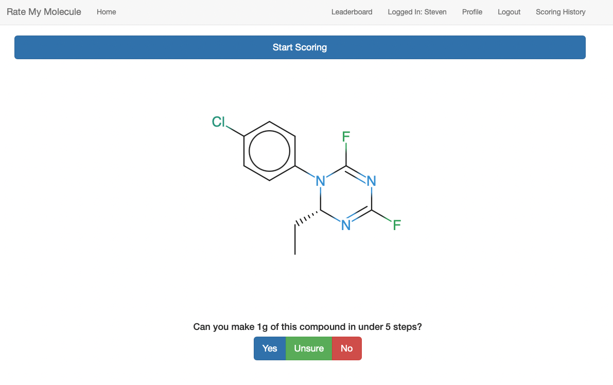

# Rate My Molecule:



Software package for predicting synthetic accesibility of organic molecules. The tools are deployed as a Flask webapp, using PostgreSQL database.

This code was developed by Steven Bennett, while undergoing my PhD in the Jelfs group, [jelfs-group.org](http://www.jelfs-group.org/).

## Installation
### Prerequisites
* Install Docker [OS specific instructions.](https://docs.docker.com/install/).
* Install [docker-compose](https://docs.docker.com/compose/install/#install-compose).

### Building the RateMyMolecule Image

The RMM image can be built using the Dockerfile in the repository ``flask/Dockerfile``. This will build the Flask image to the local machine, however, database-based operations will be unable to be run, if the PostgreSQL container is not running.

### Database Management

The  ``docker-compose.yml`` contains the configuation to deploy the full-stack. This does not require that the RMM Flask image is has been built. To build and run the initial database run
```bash

    docker-compose build database
    docker-compose up -d database
```

This will run the ``database`` Docker image in the background, creating a user, ``example``, and database ``example`` also. It will populate both of them with the SMILES molecules present.


To run the full-stack run
```bash

    docker-compose build
    docker-compose up
```
This will run the three images required to serve the website on ``localhost``, ``database``, ``flask`` and ``nginx``.

If using this